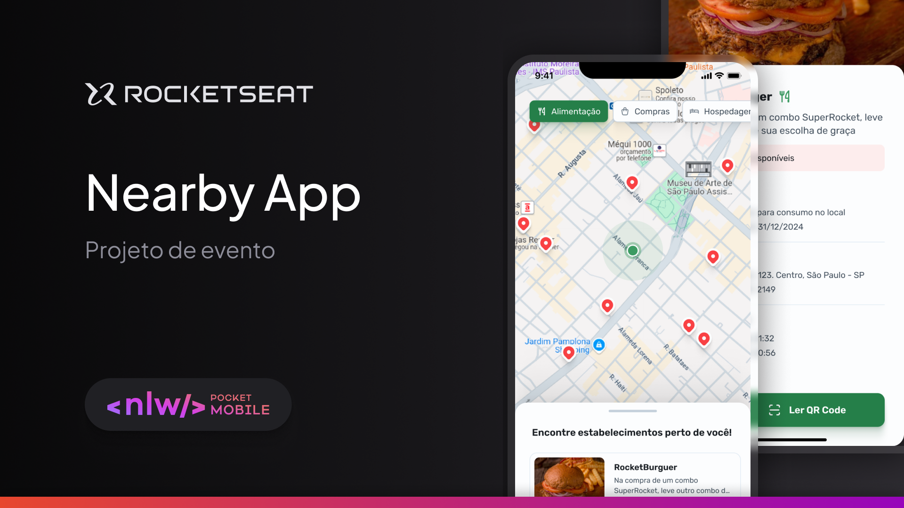

<div align="center" id="top">
  

  &#xa0;

</div>

<h1 align="center">Nearby</h1>

<hr>

<p align="center">
  <a href="#dart-about">About</a> &#xa0; | &#xa0;
  <a href="#sparkles-features">Features</a> &#xa0; | &#xa0;
  <a href="#rocket-technologies">Technologies</a> &#xa0; | &#xa0;
  <a href="#white_check_mark-requirements">Requirements</a> &#xa0; | &#xa0;
  <a href="#checkered_flag-starting">Starting</a> &#xa0; | &#xa0;
  <a href="#memo-license">License</a> &#xa0; | &#xa0;
  <a href="https://github.com/andrelinos/nlw-pocket-mobile" target="_blank">Author</a>
</p>

<br>

## :dart: About ##

Describe your project

## :sparkles: Features ##

:heavy_check_mark: List by categories;\
:heavy_check_mark: Filter categories;\
:heavy_check_mark: Show details;

## :rocket: Technologies ##

The following tools were used in this project:

- [Expo](https://expo.io/)
- [React Native](https://reactnative.dev/)
- [TypeScript](https://www.typescriptlang.org/)

## :white_check_mark: Requirements ##

Before starting :checkered_flag:, you need to have [Git](https://git-scm.com) and [Node](https://nodejs.org/en/) installed.

## :checkered_flag: Starting ##

```bash
# Clone this project
$ git clone https://github.com/andrelinos/nearby

# Access
$ cd nearby

# Install dependencies
$ npm i

# Run the project
$ expo start

```

## :memo: License ##

This project is under license from MIT.

Made with :heart: by <a href="https://github.com/andrelinos/nlw-pocket-mobile" target="_blank">Andrelino Silva</a>

&#xa0;

<a href="#top">Back to top</a>
